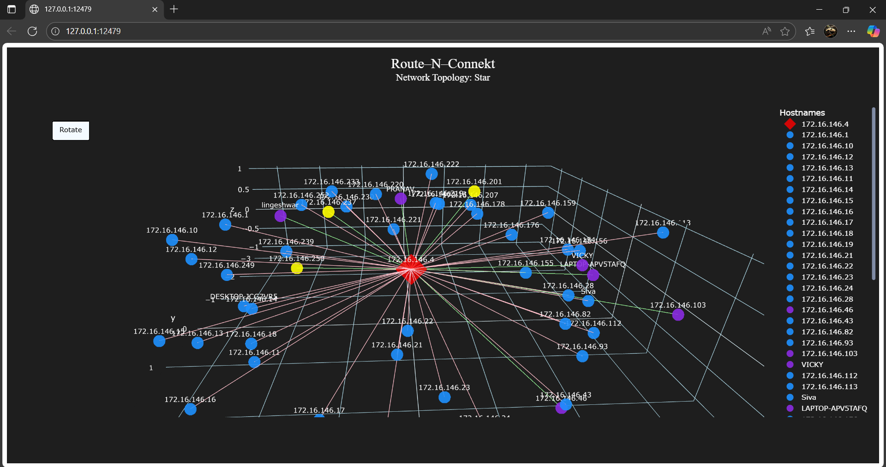
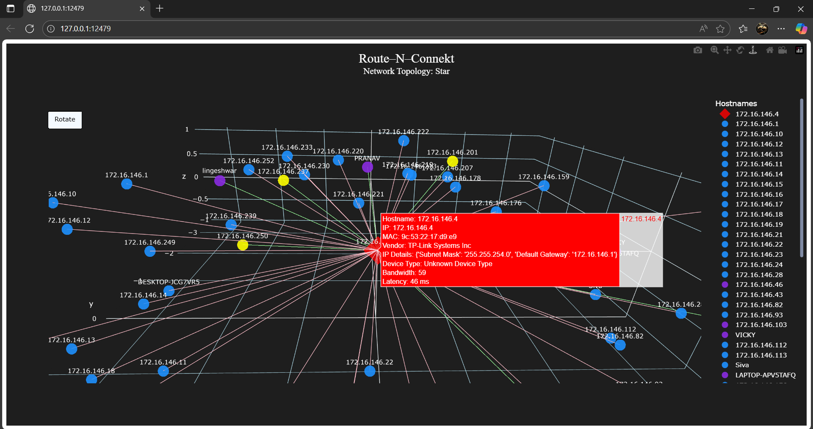
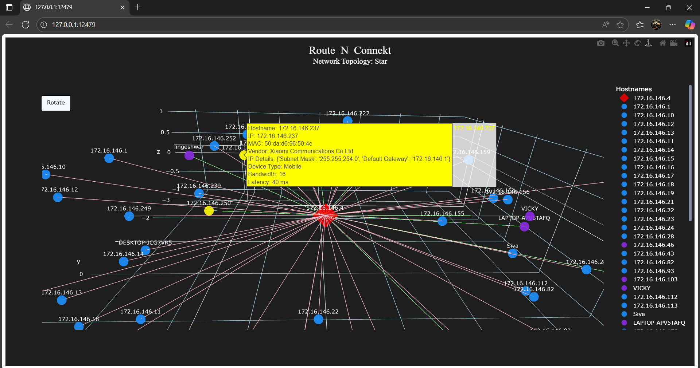

# 🛰️ Route-N-Connekt

Route-N-Connekt is a **Network Scanning & Visualization Tool** built in Python.  
It scans your local network, identifies connected devices, fetches additional network details, and generates both **static and interactive network topology maps**.

---

## 🚀 Features
- 🔎 **Device Discovery** – Scans network using ARP and resolves hostnames.
- 🏷 **Vendor & Device Type Identification** – Extracts vendor from MAC address (via APIs & OUI lookup).
- 📡 **Network Insights** – ARP table, DNS cache, network shares, profiles, RPC endpoints.
- 🔐 **Port Scanning** – Detects open TCP/UDP ports.
- 🔗 **Interface & LLDP Capture** – Finds system interfaces and neighbors.
- 📊 **Topology Detection** – Identifies Star, Mesh, Ring, Bus, Hybrid networks.
- 🎨 **Visualization**  
  - Static topology using **Matplotlib & NetworkX**  
  - Interactive 3D topology using **Plotly**

---
## 📸 Screenshots

---
